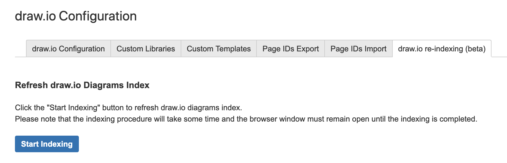

### Does draw.io work with site renames for Jira and Confluence Cloud?

Yes. There is functionality in place to detect a site rename and check everything is correct when each diagram is displayed.

There is a draw.io indexing feature that can be run when a site is renamed. This is will check all diagrams will display and export correctly in one step. You can run the re-indexer by going to https://BASE_URL/wiki/plugins/servlet/ac/com.mxgraph.confluence.plugins.diagramly/drawioConfig (where BASE_URL is substituted for your instances, e.g. "company.atlassian.net", clicking on the **draw.io re-indexing** tab:

Then click **Start Indexing** and wait until the process is complete.
