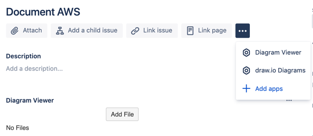
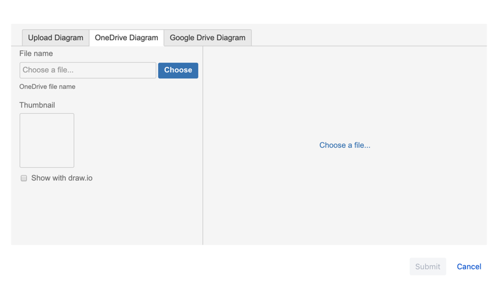
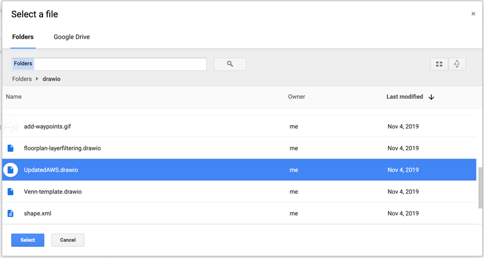
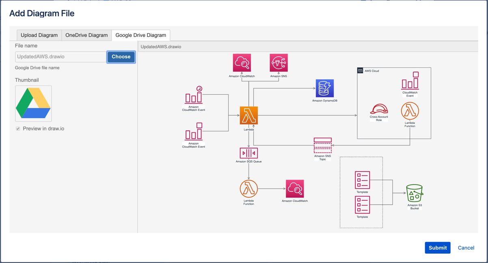
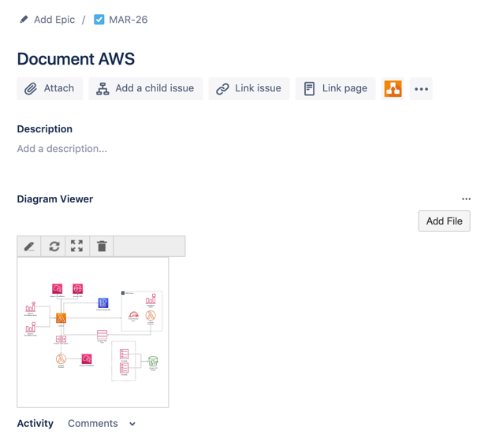

# Using the diagram Viewer app in Jira

To see the files attached to Jira issues using the Diagram Viewer, you need to display the app's section.

  * Click on the three dots next to _Link page_ in the issue toolbar, then select _Diagram Viewer_. This section usually appears below the issue _Description_.  
  

## Attach a file to a Jira issue

1. Click on _Add File_ in the Diagram Viewer section of your Jira issue (as seen above). The _Add Diagram File_ dialog is displayed.  

2. Choose which cloud platform you want to attach your file from - select the _OneDrive Diagram_ or the _Google Drive Diagram_ tab at the top of the dialog. Then click Choose. 
If you haven't previously allowed Jira to access your cloud platform, click on the blue _Authorize Diagram Viewer for Jira_ button, log in and authorize access.
3. Navigate to and select the file you want to attach to the issue, then click _Select_. 

4. A preview of the file is opened in the _Add Diagram File_ dialog. If the file you added is a diagram file, the _Preview in draw.io_ checkbox is automatically selected. This lets other users view and interact with your diagram files.  
  
5. Click _Submit_. The diagram appears in the Diagram Viewer section in the Jira issue.  

When a user hovers over a diagram attached via the Diagram Viewer, the toolbar at the top allows them to edit the diagram using draw.io, refresh the diagram (in case the file stored on your cloud platform has been edited), or view the diagram in the draw.io viewer.
