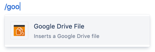
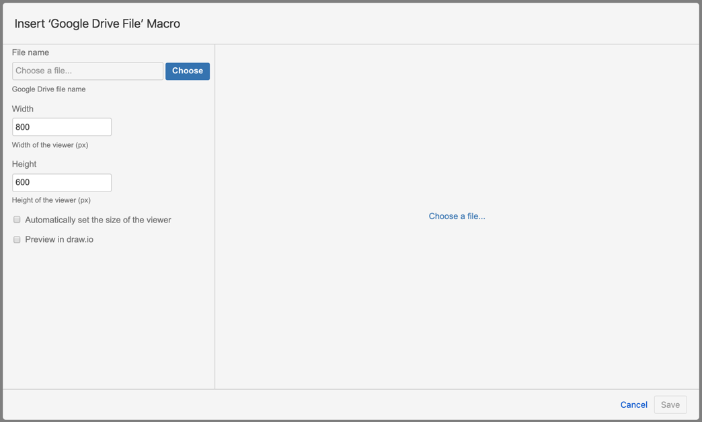
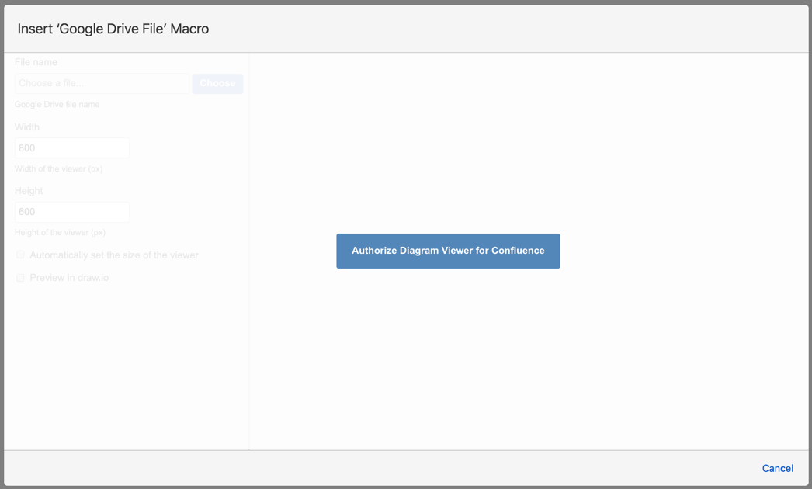
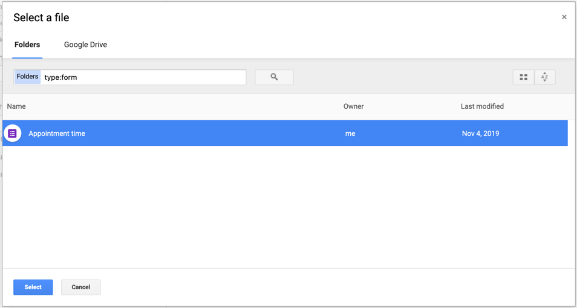
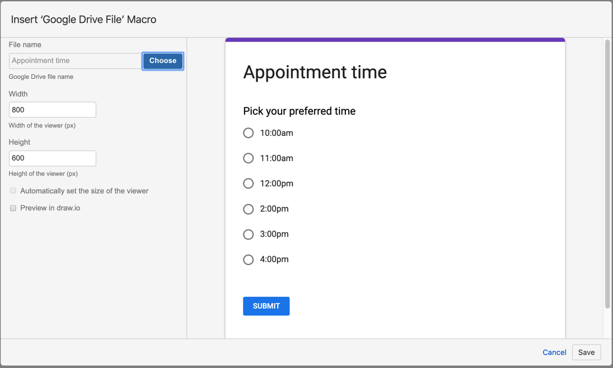
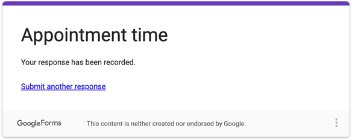

# Using the Google Drive File macro in Confluence

Use the Google Drive File macro to embed a file stored in your Google Drive account into Confluence Cloud using the Diagram Viewer app.

## How to embed a file from Google Drive

1. While editing a Confluence Cloud page, type ``/goo`` to see the Google Drive File macro pop up under your text. Alternatively, click _Insert +_ in the toolbar, if the Google Drive File macro isn't listed, click _View more_ and search for the macro.  

2. Select it and the Google Drive File selector dialog opens.  
  
If you have not previously logged into Google and allowed Confluence to access your Google Drive, click on the _Authorize Diagram Viewer for Confluence_ button, log in and click _Allow_ to connect Confluence to your account.  

3. Click _Choose_, then navigate to and select the file you want to embed. You can filter files by typing a file type into the search field or searching for a filename. For example ``type:form`` displays the Google forms you have saved in your Google Drive.  

4. Once you have selected the file, click _Select_.
5. The preview shows the contents of your file. If this is a draw.io, .VSD or .VSDX diagram file, two checkboxes are automatically selected:
   * _Automatically set the size of the viewer_ - resizes the viewer to match the size of your diagram.
   * _Show with draw.io_ - lets page viewers interact with your diagram to step through pages or display/hide layers.  

You can set a different width and height for the viewer. Make sure the _Automatically set the size of the viewer_ checkbox is deselected, then click in the _Width_ and _Height_ fields to change their values.
6. Click _Save_ to embed your file, and publish your Confluence page. If you embedded a Google Form, page viewers can submit it.

Viewers can hover over the embedded files and see toolbars that let them interact with the files. These toolbars are different depending on the file type you have embedded.

