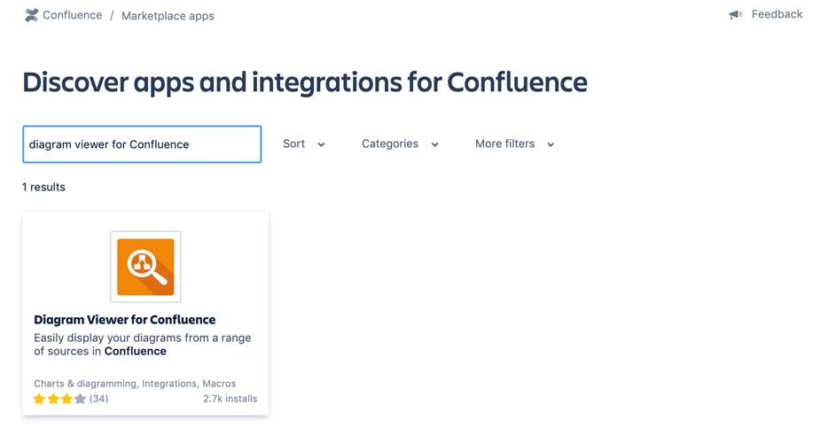
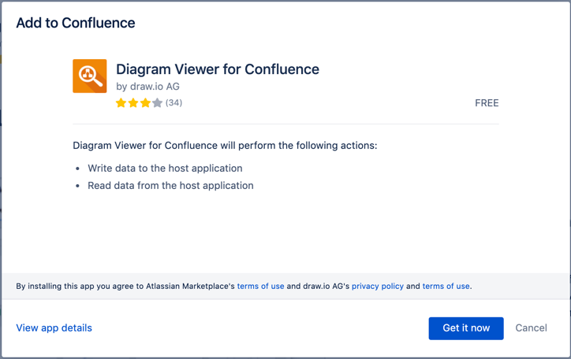
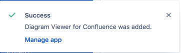

# Installing the Diagram Viewer apps

1. In your Confluence Cloud or Jira Cloud instance, click on _Settings_ in the left-hand menu.
2. Under the Atlassian Marketplace section, click on _Find new apps_.
3. Enter ``diagram viewer for Confluence`` or ``diagram viewer for Jira`` in the _Filter apps_ search field.  

4. Click on the result to see the Atlassian Marketplace description of the app. The Diagram viewer apps are developed by draw.io AG. Click on _Get app_.  

5. In the Add to Confluence or Add to Jira dialog, click on _Get it now_ to confirm you do want to install the Diagram Viewer app.  

6. As soon as you see the Success notification, the Diagram Viewer app is ready to be used in your instance.  

Now that the Diagram Viewer is installed, see how to:

- [Use the Google Drive File macro in Confluence](google-drive-file-macro-confluence.md).
- [Use the OneDrive File macro in Confluence](onedrive-file-macro-confluence.md).
- [Use the Diagram Viewer app in Jira](diagram-viewer-app-jira.md).
