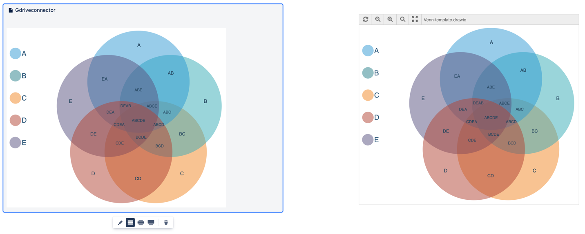

# Introduction

The Diagram Viewer apps for Confluence and Jira let you embed diagrams and other files into your Confluence Cloud pages and attach these files to your Jira Cloud issues from the most common cloud storage platforms, Google Drive and OneDrive.

**On this page**
<!-- TOC depthFrom:2 depthTo:6 withLinks:1 updateOnSave:1 orderedList:0 -->

- [Overview](#overview)
- [Authentication and security](#authentication-and-security)
- [Supported file formats](#supported-file-formats)
- [Diagram Viewer app for Confluence Cloud](#diagram-viewer-app-for-confluence-cloud)
- [Diagram Viewer app for Jira Cloud](#diagram-viewer-app-for-jira-cloud)
- [Support](#support)

<!-- /TOC -->

## Overview

The documentation for the Diagram Viewer apps will get you started quickly.

| **Topic**                     | **Description**                                                                                                                                               |
|:----------------------------- |:------------------------------------------------------------------------------------------------------------------------------------------------------------- |
| Introduction                  | [General information](#introduction)   [Authentication and security](#authentication-and-security)  [Supported file formats](#supported-formats)   |
| Installation                  | [How to install the Diagram Viewer apps in Confluence or Jira](installation.md)                                                                               |
| Diagram Viewer for Confluence | [How to use the Google Drive File macro](google-drive-file-macro-confluence.md)  [How to use the OneDrive File macro](onedrive-file-macro-confluence.md) |
| Diagram Viewer for Jira       | [How to use the Diagram Viewer app in Jira](diagram-viewer-app-jira.md)                                                                                       |
| FAQ                           | [Frequently asked questions, solutions and tips](faq.md)                                                                                                      |

## Authentication and security

Once you have logged into OneDrive or Google Drive, and allowed the Diagram Viewer app to access your cloud storage, the login credentials stored in your browser are used to embed the files. Client-side authentications ensures that permissions are always correct - you can only embed the files that you (the user) can see.

**Note:** Administrators do not need to grant the app any special permissions for users to be able to embed files.

## Supported file formats

You can embed files stored in Google Drive and One Drive in the following formats:

- draw.io diagrams
- VSD and VSDX file types
- Google and Microsoft Office files: documents, spreadsheets, presentations
- Images and PDF files
- Audio and video files
- Photos and photo albums
- Google Forms (supports form submission)
- Folders

## Diagram Viewer app for Confluence Cloud

The Diagram Viewer app for Confluence Cloud allows you to embed files from OneDrive or Google Drive into a page using one of two macros:

- [How to use the Google Drive File macro](google-drive-file-macro-confluence.md)
- [How to use the OneDrive File macro](onedrive-file-macro-confluence.md)

## Diagram Viewer app for Jira Cloud

The Diagram Viewer app for Jira Cloud allows you to attach files that have the [supported file formats](#supported-file-formats) above, and view diagram files easily using draw.io.

- [How to use the Diagram Viewer app for Jira](diagram-viewer-app-jira.md)

## Support

Please check the [FAQ](faq.md) to see if your question has been answered or follow the steps there to [post your question on Atlassian Answers](faq.md#where-can-I-get-support).
