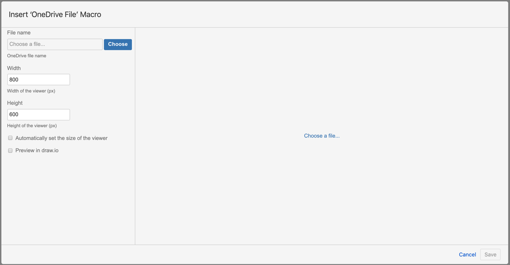
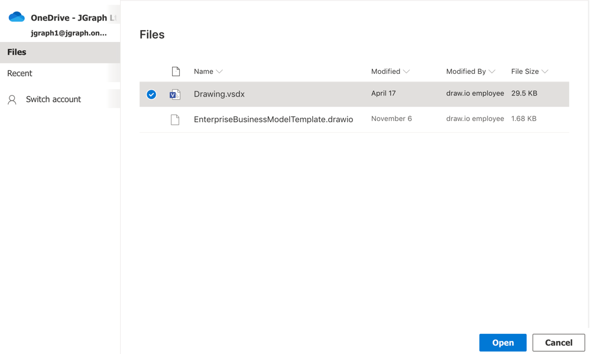
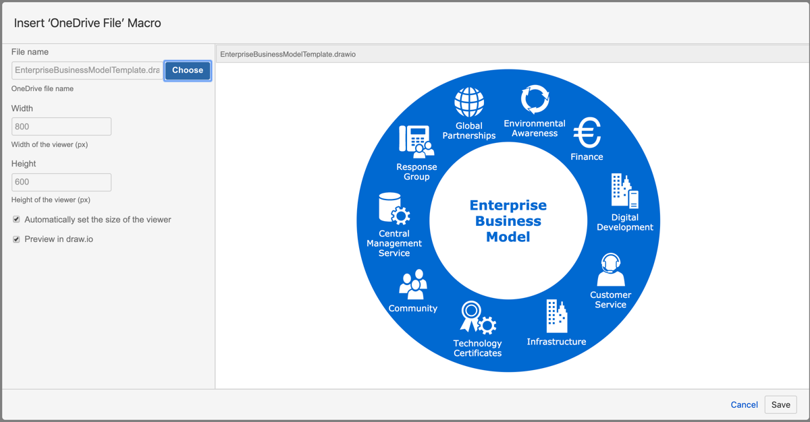

# Using the OneDrive File macro in Confluence

Use the OneDrive File macro to embed a file stored in your OneDrive account into Confluence Cloud using the Diagram Viewer app.

## How to embed a file from OneDrive

1. While editing a Confluence Cloud page, type ``/one`` to see the OneDrive File macro pop up under your text. Alternatively, click _Insert +_ in the toolbar, if the OneDrive File macro isn't listed, click _View more_ and search for the macro.  

2. Select it and the OneDrive file selector dialog opens.  

 If you have not previously logged into OneDrive and allowed Confluence to access your files, click on the _Authorize OneDrive Connector_ button, log in and allow Confluence to connect to your account.
3. Click _Choose_, then navigate to and select the file you want to embed.  

4. Once you have selected the file, click _Open_.
5. The preview will show you the contents of your file. If this is a draw.io, .VSD or .VSDX diagram file, two checkboxes will automatically be selected:
   * _Automatically set the size of the viewer_ - resizes the viewer to match the size of your diagram.
   * _Show with draw.io_ - this lets page viewers interact with your diagram to step through pages or display/hide layers. 
 
You can also set a different width and height for the viewer. Make sure the _Automatically set the size of the viewer_ checkbox is deselected, then click in the _Width_ and _Height_ fields to change their values.
6. Click _Save_ to embed your file, and publish your Confluence page.

Viewers can hover over the embedded files and see toolbars that let them interact with the files. These toolbars are different depending on the file type you have embedded.

